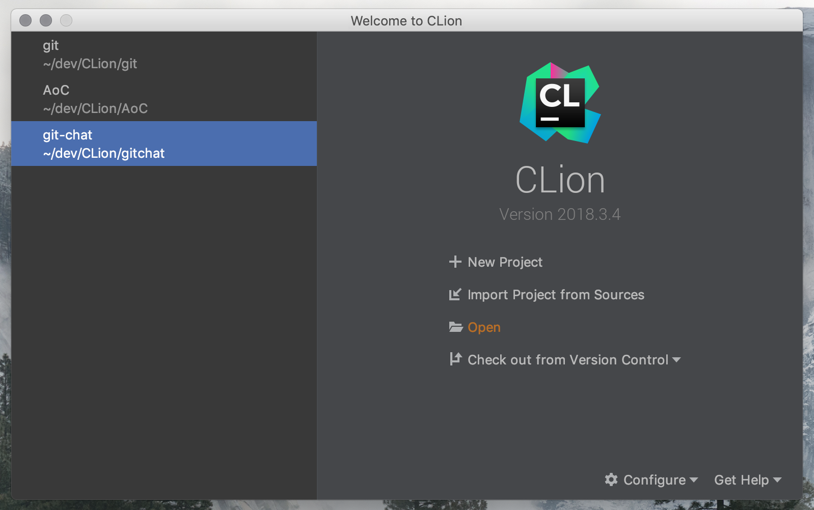
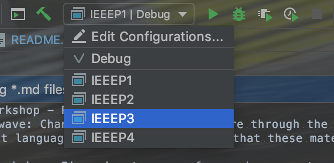

# IEEE Workshop - Pointers on C
Welcome :wave: Chances are you stumbled here through the workshop I gave for IEEE UNB. The purpose of this workshop is to give engineering students some helpful tips on writing better C. The C programming language is arguably the most difficult language to master, but I hope that these materials will help you take another step forward.

In this workshop, I'm going to cover four main concepts:
- Using Structures Effectively
- Good Memory Management Tips
- Variadic Functions
- Functional Programming

In doing this, I hope to also demonstrate how to use the CLion IDE, CMake build tool, Git for version control, and demonstrate good C code style guidelines.

The topics in this workshop are fairly introductory, but assume those attending the workshop have a fairly basic exposure to C.

## Project Roadmap
Each directory in this project is an individual CMake project. All the projects already configured and can be built and executed using CMake. There is also a top-level `CMakeLists.txt` file in the project root directly that is used to automatically setup the project when you load it in your IDE.

Parts 1, 2 and 3 are already written--they are examples that demonstrate the topics in the workshop. They should all compile and run as expected.

Part 4 is a programming puzzle! You are given a description of the puzzle in the README and a boilerplate Hello World C application. Write your solution and compile it to get a gold star :star:

Each part in this workshop has a README which provides information and examples on the topics covered.

## Getting Started
First things first, you want to install CLion. CLion is a powerful development environment for professionals.

Next, you want to clone the repository using git via the command line.
```
cd ~/dev
git clone https://github.com/brandon1024/IEEE-Workshop.git
cd IEEE-Workshop
```

Next, start CLion and select `Open`. Browse to the directory that you cloned the project to, and open the project.



You should now be all set! To run one of the parts, just select it from the list of run configurations and click `Run`.



## Where Can I Get More Info?
If you want to become a good C developer, you should read through the [coding guidelines](https://git.kernel.org/pub/scm/git/git.git/tree/Documentation/CodingGuidelines). This coding style is what I have adopted, and it has really helped me write clean C code.

If you plan to work on a C project, I highly recommend learning how to use the CMake build tool. The learning curve is steep, and it's very different than tools like `gradle` or `npm`, but it will save you headache down the road.

## Who Am I?
My name is Brandon Richardson, I am a software engineering student in my fourth year of university at the University of New Brunswick. Over the past two years, I have taken interest in the C programming language, and now a large majority of my programming today is in C.